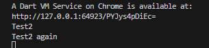
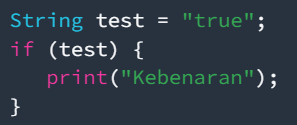
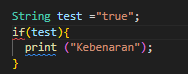
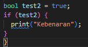
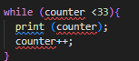
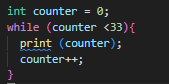
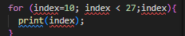
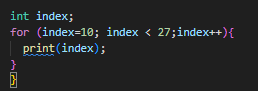
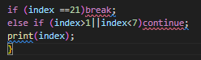

# JOBSHEET 3

# Nama : Lilla Nur Wahidiyah

# Kelas : TI 3B/ 17

# NIM : 2241720144

## Tugas Praktikum

Silakan selesaikan Praktikum 1 sampai 3, lalu dokumentasikan berupa screenshot hasil pekerjaan beserta penjelasannya!

### Control Flows (if/else)

```java
void main() {
  String test = "test2";

  if (test == "test1") {
    print("Test1");
  } else if (test == "test2") {
    print("Test2");
  } else {
    print("Something else");
  }

  if (test == "test2") {
    print("Test2 again");
  }
}
```

hasil run :


Menambahkan kode

Hasil

Terdapat eror karena pemilihan true false bukan seharusnya menggunakan tipe string melainkan boolean.

<p>Perbaikan kode :


### Perulangan

WHILE DAN DO WHILE

Menambahkan kode
..
Hasil


<p>Terdapat eror karena variabel counter belum dinisiasi

Perbaikan Kode



FOR DAN BREAK-CONTINUE

TErjadi eror karena tidak ada inisiasi nilai variable

<p> Pembenaran



Penambahan program


<p>Terjadi eror karena variabel tidak diinisiasi sebeulmnya

Pembenaran

```java
for (int index = 10; index < 27; index++) {
    if (index == 21) {
      break; // Move break statement inside the loop
    } else if (index > 1 && index < 7) {
      continue; // Move continue statement inside the loop
    }
    print(index);
  }
```

### TUGAS PRAKTIKUM

Buatlah sebuah program yang dapat menampilkan bilangan prima dari angka 0 sampai 201 menggunakan Dart. Ketika bilangan prima ditemukan, maka tampilkan nama lengkap dan NIM Anda.
Kumpulkan berupa link commit repo GitHub pada tautan yang telah disediakan di grup Telegram!

```dart
void main() {
  for (int num = 2; num <= 201; num++) {
    if (isPrime(num)) {
      print('$num adalah bilangan prima - Lilla Nur Wahidiyah, NIM: 2241720144');
    }
  }
}

bool isPrime(int num) {
  if (num < 2) return false;
  for (int i = 2; i <= num ~/ 2; i++) {
    if (num % i == 0) return false;
  }
  return true;
}
```
